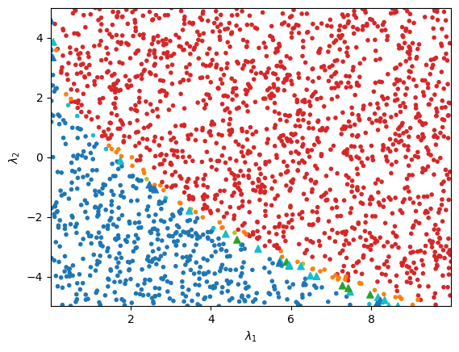

.. _analysis:

Tutorial Step 4: Analysis  
=========================

By the end of :ref:`the last section of the tutorial <training>`, we have produced a saved :class:`BFBLearner <bfbrain.BFB_Learner.BFBLearner>` object which contains a binary classifier in the form of a Bayesian 
neural network. We can now use this classifier to produce predictions on arbitrary sets of quartic coupling coefficients in the scalar potential's model. A neural network produced by BFBrain has the following characteristics

* It will take inputs in the form of a two-dimensional Tensorflow tensor or NumPy array which represents a batch of sets of quartic coefficients, where each set of quartic coefficients uniquely specifies a point in parameter space of the scalar potential model. Each set of quartic coefficients must be in the same basis as the quartic coefficients supplied to the user-created SymPy expression that defines the potential for BFBrain.
* It will produce outputs in the form of classification scores between 0 and 1, with an output of < 0.5 indicating that the model predicts a point is *not* bounded-from-below, while an output >= 0.5 indicates that the model predicts that a given point *is* bounded-from-below.
* It is a Bayesian neural network implemented using concrete dropout, a variety of Monte Carlo dropout. As such, it makes predictions via repeated forward passes of inputs with the neural network, where different internal neuron outputs are randomly set to 0 during each evaluation. :ref:`Different uncertainty metrics <score_fns>` can be extracted from the mean and variance of the predictions from each forward pass.

For conducting analyses with these models, BFBrain also features a number of convenience methods which allow for easy prediction and uncertainty estimation over arbitrary inputs. For making predictions,
it is recommended to use the :meth:`MC_call_fast <bfbrain.Score_Functions.MC_call_fast>` method. Given a valid input to the neural network, this method will rapidly compute the model's mean prediction of a
user-specified number of forward passes through the network, and return the result as a one-dimensional Tensorflow tensor, with one prediction for each set of quartic coupling coefficients in the input.
The following code will load the previously-trained 2HDM classifier created by following the previous tutorial steps in a new file and compute Monte Carlo dropout predictions on a 2-dimensional slice of
parameter space points in the inert doublet model (IDM), in which a number of couplings in the most general 2HDM are set to zero.

.. code-block:: python

    from bfbrain import BFBLearner, MC_call_fast
    import numpy as np
    from numpy.random import default_rng

    # Generate 100000 random sets of 2HDM quartic coefficients,
    # all of which have values between -5 and 5.
    rng = default_rng(12345)

    slice_scan = np.empty(shape = (2000, 10))

    slice_scan[:,0] = 10.
    slice_scan[:,3] = 1.
    slice_scan[:,4] = 5.
    slice_scan[:,5:] = 0.

    slice_scan[:,1] = rng.uniform(0., 10., len(slice_scan))
    slice_scan[:,2] = rng.uniform(-5., 5., len(slice_scan))

    # Load the neural network produced by the last script
    AL = BFBLearner.from_file('saved_AL')

    # Make predictions on rand_lams using Monte Carlo dropout with 
    # 100 forward passes through the network.
    preds = (MC_call_fast(AL.model, slice_scan, n_trials = 100) >= 0.5).numpy()

It is further possible to use any of the uncertainty measures discussed in :ref:`the previous tutorial step <score_fns>` to extract not only predictions, but measurements of the model's uncertainty
regarding those predictions. It is important to note that uncertainty scores reported by BFBrain's various methods are only reliable metrics of *relative* uncertainties compared to other inputs,
and are thus not meaningful if evaluated for individual points in isolation. A user may circumvent this limitation by creating a "calibration set" of uniformly sampled random inputs, and computing an
uncertainty measure on these inputs to get a sense for the scale of the measure, and hence the degree of reliability of individual predictions in other distributions. BFBrain automates this process
with the method :meth:`BFBLearner.get_calibration_uncertainties <bfbrain.BFB_Learner.BFBLearner.get_calibration_uncertainties>`. Because the principal use case of BFBrain will be to probe points in and
around the bounded-from-below region, :meth:`get_calibration_uncertainties <brbrain.BFB_Learner.BFBLearner.get_calibration_uncertainties>` outputs the uncertainties for all points in its generated sample
that are classified as bounded-from-below-- in [1]_, we found that this procedure gave the best uncertainty quantification. We can use
:meth:`get_calibration_uncertainties <brbrain.BFB_Learner.BFBLearner.get_calibration_uncertainties>` in our script above by appending the line:

.. code-block:: python

    from bfbrain import BALD

    # Get quantitative information about the scales of model uncertainties
    # by generating 10^5 points uniformly sampled from the surface of the 
    # hypersphere, computing the model's mutual information on each point
    # and preserving the results for all points that the model predicts
    # to be bounded-from-below (which tend to have higher uncertainties).
    cal_set = AL.get_calibration_uncertainties(score_fn = 'BALD', nlams = 100000, n_trials = 100)

    # Compute the uncertainty (from mutual information) for slice_scan
    # with 100 forward passes through the neural network.
    uncerts = BALD(AL.model, slice_scan, n_trials = 100).numpy()

Now, we can get a sense for which predictions in the distribution we wish to consider, slice_scan, are potentially unreliable by comparing the results of uncerts with the uncertainty quantiles of
cal_set-- in [1]_ we have found that for mutual information in particular, this methodology is efficient at determining unreliably classified regions of parameter space.

To illustrate the results, we can complete our script with some simple plotting machinery. For the inert doublet model, there's a compact symbolic expression for the necessary and sufficient
bounded-from-below conditions, so we can also check to see if our general 2HDM classifier's predictions of boundedness-from-below works for the inert doublet model. Our plotting script will be

.. code-block:: python

    # Two plotting helper functions. 
    # generate_colors colors plots based on their uncertainty
    # (estimated via mutual information) and classification.
    def generate_colors(preds, uncerts, calibration_set):

        quantile_95 = np.quantile(calibration_set, 0.95)
        quantile_99 = np.quantile(calibration_set, 0.99)

        def check_color(pred, uncert):
            if(pred >= 0.5):
                if uncert > quantile_99:
                    return 'tab:olive'
                if uncert > quantile_95:
                    return 'tab:orange'
                return 'tab:red'
            else:
                if uncert > quantile_99:
                    return 'tab:green'
                if uncert > quantile_95:
                    return 'tab:cyan'
                return 'tab:blue'
        return np.array([check_color(pred, uncerts[i]) for i, pred in enumerate(preds)])

    # find_good_predictions uses the truth-level expression
    # for the bounded-from-below conditions in the inert 
    # doublet model to identify where the BFBrain model is
    # wrong for this subset of 2HDM's.
    def find_good_predictions(lams, preds):
        def truth_BFB(lam):
            if lam[0] <= 0 or lam[1] <= 0:
                return False
            if lam[2] + np.sqrt(lam[0]*lam[1]) <= 0:
                return False
            return lam[2] + lam[3] - np.abs(lam[4]) + np.sqrt(lam[0]*lam[1]) > 0
        def check_pred(pred, lam):
            return (pred and truth_BFB(lam)) or ((not pred) and not truth_BFB(lam))
        return np.array([check_pred(preds[ind], lams[ind]) for ind in range(len(lams))])

    colors_in = generate_colors(preds, uncerts, cal_set)
    good_preds = find_good_predictions(slice_scan, preds)

    # Produce a scatter plot of the BFBrain model's predictions.
    fig, ax = plt.subplots()
    ax.scatter(np.transpose(slice_scan)[1][good_preds], np.transpose(slice_scan)[2][good_preds], c = colors_in[good_preds], marker = '.')
    ax.scatter(np.transpose(slice_scan)[1][~good_preds], np.transpose(slice_scan)[2][~good_preds], c = colors_in[~good_preds], marker = '^')
    ax.set_xlabel(r'$\lambda_1$')
    ax.set_ylabel(r'$\lambda_2$')
    ax.margins(x=0,y=0)
    plt.show()

This script should produce something like the following image:

Above, points are red, orange, or olive if they are predicted to be bounded-from-below, and blue, cyan, or green if they are predicted to be *not* bounded-from-below.
The different colors denote different mutual information values relative to the mutual information quantiles of cal_set-- olive (green) represents a bounded-from-below (not bounded-from-below) 
predicted point that has mutual information greater than the 0.99 quantile of cal_set, while orange (cyan) denotes a point with mutual information greater than the 0.95 quantile, and 
red (blue) represents a point equal to or below the 0.95 quantile. Points that are misclassified, determined using the truth-level symbolic bounded-from-below conditions for the
inert doublet model, are depicted as triangles. We see that the :class:`BFBLearner <bfbrain.BFB_Learner.BFBLearner>` object achieves an excellent degree of accuracy in the parameter space scan,
and that incorrectly classified points are disproportionately points with high uncertainty.

.. _outsidebfbrain:

Advanced Usage: Loading the Model Outside of BFBrain
----------------------------------------------------

Because the :attr:`BFBLearner.model <bfbrain.BFB_Learner.BFBLearner.model>` object is saved as a Tensorflow SavedModel object, it boasts significant portability. In particular,
it is possible to load the model entirely without reference to the BFBrain package, or even outside of Python-- this may be useful if interfacing a BFBrain classifier with
other programs.

A :attr:`BFBLearner.model <bfbrain.BFB_Learner.BFBLearner.model>` loaded outside of BFBrain will behave like any other feed-forward Tensorflow model in its new environment.
The sole additional caveat to using the model in this manner is that BFBrain's various convenience methods for generating Monte Carlo dropout predictions or extracting uncertainty
estimates will not be available without reference to the BFBrain package. However, in practice it is possible to implement Monte Carlo dropout from scratch quite easily-- the following
script demonstrates the technique in Python:

.. code-block:: python

    import tensorflow as tf

    model = tf.keras.models.load_model('saved_AL/model')

    # Generate a random batch of quartic coupling coefficient sets.
    test_input = tf.random.uniform(shape=(10000, 10), minval = -5., maxval = 5.)

    # Calling the model normally will give a deterministic result, since Tensorflow assumes dropout
    # is only used during training.
    # Dropout can be included with the flag training = True. This gives a single prediction with dropout.
    pred = model(test_input, training = True)

    # We can write a function which does Monte Carlo dropout as follows:
    def MC_call_fast(model, lams, n_trials):
        result = tf.reshape(model(lams, training = True), shape=[-1])/tf.cast(tf.constant(n_trials), tf.float32)
        for _ in tf.range(tf.constant(1), tf.constant(n_trials)):
            result = result + tf.reshape(model(lams, training = True), shape=[-1])/ tf.cast(tf.constant(n_trials), tf.float32)
        return result

    # Since we're working in Python, the above can be sped up using the @tf.function decorator, but we don't do that here.

.. [1] G.N. Wojcik. "BFBrain: Scalar Bounded-from-Below Conditions with Bayesian Active Learning" [`arXiv:2309.10959 <https://arxiv.org/abs/2309.10959>`_ [hep-ph]]
