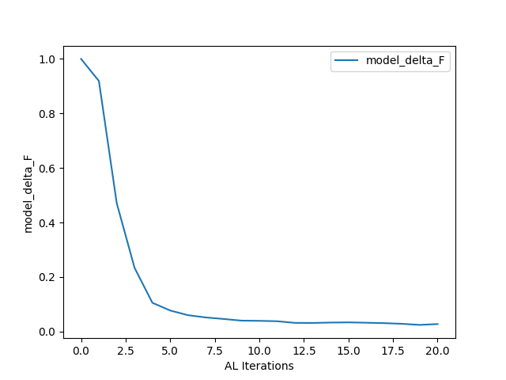
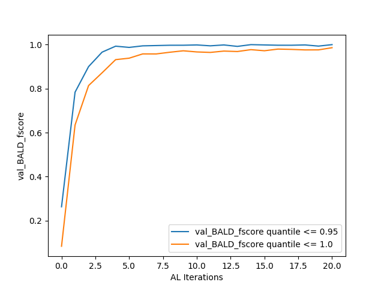

.. _training:

Tutorial Step 3: Training  
=========================

With the :class:`BFBLearner <bfbrain.BFB_Learner.BFBLearner>` object and all performance metrics initialized, a single line of code can now be used to perform the active learning loop for a 
specified number of iterations via the :meth:`AL_loop <bfbrain.BFB_Learner.BFBLearner.AL_loop>` method. 
With the example :class:`BFBLearner <bfbrain.BFB_Learner.BFBLearner>`
that we implemented in :ref:`the last tutorial section <classifier>`, which we named AL, a typical call to :meth:`AL_loop <bfbrain.BFB_Learner.BFBLearner.AL_loop>` might be

.. code-block:: python

    AL.AL_loop(filepath = 'saved_AL', nstop = 20)

All inputs to :meth:`AL_loop method <bfbrain.BFB_Learner.BFBLearner.AL_loop>` possess default values and can therefore be called for a wide variety of scalar potentials without *any* user input, however for clarity
we have specified the two most important arguments above. Given the sheer number of options that are exposed to the user in :meth:`AL_loop method <bfbrain.BFB_Learner.BFBLearner.AL_loop>`, it is recommended
that a user always specify keyword, rather than positional, arguments when invoking this method.

The first argument we have supplied, filepath, gives the name under which the :class:`BFBLearner <bfbrain.BFB_Learner.BFBLearner>` object will be saved after
the active learning loop completes. After active learning, a directory under this name will appear in the Python script's directory which is of the appropriate form to load a :class:`BFBLearner <bfbrain.BFB_Learner.BFBLearner>`
object in a later session. The second argument we have specified, nstop, will specify the number of active learning iterations that the model should perform-- in this case, 20-- before terminating.

If a reader has been following along, running this code can take as long as two hours to complete on a personal laptop with a single GPU. For demonstrative purposes, we may recommend running the following code,
which will perform the same active learning training loop but terminates after just two rounds of active learning, allowing the run to complete in a matter of minutes:

.. code-block:: python

    AL.AL_loop(filepath = 'saved_AL', nstop = 2)

At the end of active learning, our 'saved_AL' directory will have the structure

::

    saved_AL
    ├── data_train.npz
    ├── data_val.npz
    ├── dm.pickle
    ├── history.pickle
    ├── history_accuracy.png
    ├── history_loss.png
    ├── metrics.pickle
    ├── model
    │   ├── assets
    │   ├── fingerprint.pb
    │   ├── keras_metadata.pb
    │   ├── saved_model.pb
    │   └── variables
    │       ├── variables.data-00000-of-00001
    │       └── variables.index
    ├── model_delta_F.png
    ├── output.txt
    ├── val_BALD_fscore.png
    └── variables.pickle

Most of the information in the structure above (in particular model as well as all .npz and .pickle files) are used by BFBrain to load the :class:`BFBLearner <bfbrain.BFB_Learner.BFBLearner>` object from
a directory. However, some of the outputs contain summary information about the outcome of training.
First, 'output.txt' contains entries which tracks the results of all performance metrics in all rounds. As an example, the execution of our example program has yielded the entry

::

    Metrics for round 20:
    val_BALD_fscore (validation precision) [0.95, 1.0]:
    [0.9975669099756691, 0.9953810623556582]
    val_BALD_fscore (validation recall) [0.95, 1.0]:
    [1.0, 0.9795454545454545]
    val_BALD_fscore (validation F score) [0.95, 1.0]:
    [0.9987819732034106, 0.9873997709049255]
    model_delta_F:
    0.02820636451301828

as the results for the final round's metric evaluations. Meanwhile, model_delta_F.png and val_BALD_fscore.png give simple plots of the results of the performance metrics:

Finally, principally for debugging purposes, BFBrain saves and plots the training loss and binary accuracy (extracted from the history object returned by Tensorflow's model.fit() method) across all training epochs--
users knowledgeable in machine learning may wish to inspect these results (in history_loss.png and history_accuracy.png, respectively) to ensure that their neural network is achieving a high degree of accuracy on 
the training data [*]_

After an active learning loop has been completed, anyone with access to the filepath directory (or a copy thereof) can load the :class:`BFBLearner <bfbrain.BFB_Learner.BFBLearner>` object
in order to continue training or use the model in analysis. Furthermore, training can be continued arbitrarily by repeated calls of :meth:`AL_loop method <bfbrain.BFB_Learner.BFBLearner.AL_loop>`: A repetition
of the code block above will train the existing :class:`BFBLearner <bfbrain.BFB_Learner.BFBLearner>` object for *another* 20 rounds, and overwrite the saved information in the directory 'saved_AL' with the new
:class:`BFBLearner <bfbrain.BFB_Learner.BFBLearner>` object which has now been trained for 40 rounds of active learning.

.. [*] A user who inspects these may be concerned that the loss and binary accuracy at the epoch level look highly oscillatory in later active learning rounds-- this is a consequence of the large number of highly uncertain inputs in the training set, and we haven't found it to correspond to a degradation of trained classifier performance, since the optimizer will still arrive at weights close to those which minimize the loss.

.. _customAL:

Options in the Active Learning Loop
-----------------------------------

:meth:`AL_loop <bfbrain.BFB_Learner.BFBLearner.AL_loop>` exposes a number of options to the user in order to customize the active learning loop-- these range from altering the method by which
the program evaluates new points to be added to the training set, changing how many new training points are generated at each active learning iteration, and altering the size of data batches that are passed 
simultaneously to the GPU during training and validation. A comprehensive review of all possible options for the method is included in :meth:`its documentation <bfbrain.BFB_Learner.BFBLearner.AL_loop>`, and 
readers interested in experimenting with all of BFBrain's capabilities are encouraged to read it thoroughly. For convenience, however, here we shall also list the options that a user is most likely to find useful,
or may need to change from their default values in order to meet the requirements of their analysis or machine:

* **K_batch_size, K_batch_num**: These two integer parameters specify the number of new data points that should be added to the training set during each active learning iteration. A total of K_batch_num batches of K_batch_size points are generated and combined to form each additional set of training points, so at each active learning iteration, a total of K_batch_num*K_batch_size points are appended to the training set. By default, K_batch_size=500 and K_batch_num=10, so a total of 5000 points are added to the training set during each round of active learning.
* **K_factor**: Each batch of K_batch_size training points is found by drawing the points which the model is most uncertain about from a randomly generated pool of K_factor*K_batch_size points. If the user wants to sample a larger pool of candidate points (and therefore expect to get more uncertain training inputs), this is achieved by using a larger value of K_factor. Thought of another way, AL_loop will always select the top 1/K_factor quantile of points in its pool of candidate points to add to the training data set. It is important to note that as part of active learning loop, batches of K_batch_size*K_factor points will be simultaneously passed to the GPU-- if the user is encountering OOM errors during the execution of the training loop with a particular value of K_factor, it is recommended to reduce K_batch_size and increase K_batch_num. By default, K_factor=100, so the active learning loop will select 5000 new training points at each active learning iteration out of a pool of 500000 candidates.
* **score_fn**: This specifies the method by which the active learning function estimates uncertainty in order to select points to add to the training set-- we shall discuss this option in detail in :ref:`the next section <score_fns>`.
* **batch_size, val_batch_size**: These integers specify the number of training (batch_size) and validation (val_batch_size) examples that should be passed to the GPU at one time during training and validation. In order to minimize noise in training, it is recommended if possible to specify batch_size greater than the maximum total number of points in the training data that the algorithm will encounter (so, for 20 rounds of active learning, each producing 5000 points, it is recommended to have batch_size > :math:`10^5`, plus the size of the initial training data). If this is not possible due to memory constraints, it is recommended to instead use batches that are approximately equal to the number of new training points added during each round, so that about 1 new batch is added during each training set-- otherwise sudden large changes in the number of batches late in training can result in sudden and significant degradation of performance. By default batch_size=:math:`2 \times 10^5` and val_batch_size will always be equal to batch_size unless specified otherwise.
* **verbose**: If a user wishes the information in output.txt to also be printed to the console, they can specify verbose=True
* **plot_metrics**: If a user wishes the active learning loop to produce the plots generated by :meth:`plot_metric <bfbrain.AL_Metrics.ALMetric.plot_metric>` to be printed to the console in addition to being saved after training, they can specify plot_metrics=True.

.. _score_fns:

score_fn: Uncertainty Quantification Options
--------------------------------------------

The parameter score_fn in :meth:`AL_loop <bfbrain.BFB_Learner.BFBLearner.AL_loop>` allows a user to specify different methods for the active learning loop to estimate its uncertainty regarding potential training 
points. Essentially, a function specified by the score_fn argument will assign a single "uncertainty score" to each input in a pool of candidate points, and then :meth:`AL_loop <bfbrain.BFB_Learner.BFBLearner.AL_loop>`
will add points with very large uncertainty scores relative to the pool as a whole to the training set for the next round of active learning. In [1]_, we found no significant variation in the results
from implementing different uncertainty-based strategies under normal use conditions, but a user may wish to experiment with different strategies for their particular use case.

BFBrain contains a number of built-in options for uncertainty quantification in :mod:`the Score_Functions module <bfbrain.Score_Functions>`, and they may be freely specified by string arguments for score_fn.
Because the BFBLearner's model is a binary classification neural network with Monte Carlo dropout [2]_, its predictions are computed by passing the same inputs through the neural network a number of times 
and considering the ensemble of outputs-- since different neurons are dropped out with each iteration, the model predicts different outputs for each forward pass of the same inputs.
Readers interested in the theory of various uncertainty estimates are referred to [1]_, which discusses many of these in detail, as well as the references cited in each entry-- we simply list the methods here, along
with linking to their implementations in :mod:`Score_Functions <bfbrain.Score_Functions>`.

* :mod:`'BALD' <bfbrain.Score_Functions.BALD>`: Bayesian Active Learning by Disagreement (BALD) [3]_, in which points are scored by mutual information [4]_-- which is proposed in [5]_ as an information-theoretic estimate of *epistemic uncertainty* , that is, uncertainty purely related to the model's lack of training data and not the inherent ambiguity of a given training example. This is the default value for score_fn.
* :mod:`'MaxEntropy' <bfbrain.Score_Functions.Max_Entropy>`: Shannon Entropy [4]_, which is proposed in [5]_ as an information-theoretic estimate of total predictive uncertainty.
* :mod:`'variation_ratios' <bfbrain.Score_Functions.Variation_Ratios>` : Variation ratios, which is defined as the fraction of forward passes through the neural network for which the model gives the *opposite* of the mode classification for a given input. By definition, this must be between 0. and 0.5.
* :mod:`'predictive_variance' <bfbrain.Score_Functions.Predictive_Variance>`: The standard deviation of the neural network's numerical output. Suggested to correspond to epistemic uncertainty in [6]_.
* :mod:`'QBDC' <bfbrain.Score_Functions.QBDC>`: Query by Dropout Committee [7]_, in which points where the average output of all forward passes for a given input are closest to the classification threshold are scored the highest.

Because each of the above scores are evaluated by making a large number of forward passes of given inputs through the metric, a user can also control how many forward passes are made with each method by specifying
the argument score_ntrials in :meth:`AL_loop <bfbrain.BFB_Learner.BFBLearner.AL_loop>`. If this argument is not specified, default values listed in each method's documentation are used.

Additionally, a score_fn input of 'random' will have :meth:`AL_loop <bfbrain.BFB_Learner.BFBLearner.AL_loop>` assign random scores to each point in a pool of candidates-- this can be used to demonstrate that
various active learning strategies are significantly outperforming random sampling of the parameter space for training.

Finally, a user may also implement custom score functions in the event that they would like to try active learning strategies not discussed here. In practice, this can be done by specifying any function with the signature
(tf.keras.Model, tf.Tensor(tf.float32, tf.float32)) -> tf.Tensor(tf.float32) for score_fn, that is, any function which takes a Tensorflow model (in practice a :attr:`BFBLearner.model <bfbrain.BFB_Learner.BFBLearner.model>`)
and a 2-dimensional Tensorflow tensor representing a batch of input points for the the model, and returns a 1-dimensional Tensorflow tensor of scores, one for each input. The function may also take a keyword integer argument, n_trials,
which in BFBrain's implemented functions specifies the number of forward passes each input should make through the metric to extract the score, however if the score_ntrials argument of :meth:`AL_loop <bfbrain.BFB_Learner.BFBLearner.AL_loop>`
is not specified, it is not necessary that a custom score_fn process this argument. The source code within :mod:`the Score_Functions module <bfbrain.Score_Functions>`, in which all of BFBrain's existing 
score functions are stored, provides a useful template for a user who may wish to implement any custom inputs for score_fn. The sole additional precaution that a user must take with any custom score_fn is that it must be
jit-compilable with tf.function-- Tensorflow's method for converting Python code into compilable scripts. Please see Tensorflow's documentation for restrictions regarding the use of tf.function-- in practice
most code that involves purely Tensorflow operations and basic loops and conditionals will usually fit the requirements.

Advanced Usage: Stopping Criteria
---------------------------------

Before moving on to the use of a BFBrain-generated model in analysis, we briefly touch on one type of advanced usage in :meth:`AL_loop <bfbrain.BFB_Learner.BFBLearner.AL_loop>`: Customized stopping criteria for active
learning. In [1]_, we found no significant detriment (in terms of performance of the classifiers on validation sets) associated with continuing active learning for an arbitrary number of iterations, and since training time
should only scale linearly with increasing active learning iterations, we advise most users to simply continue active learning for as many rounds at one time as feasible, and if performance on a validation set
or on another metric, such as estimated :math:`\Delta F_1` is unsatisfactory, to simply load the trained classifier and train the network for that many rounds again. Some users may, however, want to stop active learning only
once a predefined criterion based on performance metrics is reached. To that end, we implement a specialized class :class:`StoppingCondition <bfbrain.AL_Metrics.StoppingCondition>`, which can be passed to 
:meth:`AL_loop <bfbrain.BFB_Learner.BFBLearner.AL_loop>` via the keyword argument stopping_cond.

A :class:`StoppingCondition <bfbrain.AL_Metrics.StoppingCondition>` instance will monitor a :class:`performance metric <bfbrain.AL_Metrics.ALMetric>` that belongs to the :meth:`BFBLearner <bfbrain.BFB_Learner.BFBLearner>`
object that is being trained in :meth:`AL_loop <bfbrain.BFB_Learner.BFBLearner.AL_loop>`, specified in the :class:`StoppingCondition <bfbrain.AL_Metrics.StoppingCondition>` with the performance metric'S
:attr:`name string <bfbrain.AL_Metrics.ALMetric.name>`. Whenever that performance metric is updated, the :class:`StoppingCondition <bfbrain.AL_Metrics.StoppingCondition>` object will call a method,
:attr:`metric_func <bfbrain.AL_Metrics.StoppingCondition.metric_func>` on the metric-- if that function returns True, active learning will stop, while if that function returns False, active learning continues.

For user convenience, several stopping criteria are implemented as child classes to :class:`StoppingCondition <bfbrain.AL_Metrics.StoppingCondition>`, which monitor different types of metrics. These are

* :class:`ScoreNotDecreasing <bfbrain.AL_Metrics.ScoreNotDecreasing>` monitors :class:`PoolScore <bfbrain.AL_Metrics.PoolScore>` or :class:`NewDataScore <bfbrain.AL_Metrics.NewDataScore>` metrics and stops active learning if the uncertainty scores recorded by these metrics have not achieved a new minimum for some user-specified number of rounds, given by the attribute :attr:`patience <bfbrain.AL_Metrics.ScoreNotDecreasing.patience>`. This stopping condition should only be used for uncertainty metrics for which the uncertainty value should decrease with more training data-- in BFBrain these are :meth:`BALD <bfbrain.Score_Functions.BALD>`, :meth:`Variation_Ratios <bfbrain.Score_Functions.Variation_Ratios>`, and :meth:`Predictive_Variance <bfbrain.Score_Functions.Predictive_Variance>`.
* :class:`AccuracyNotImproving <bfbrain.AL_Metrics.AccuracyNotImproving>` monitors :class:`ModelEvaluation <bfbrain.AL_Metrics.ModelEvaluation>` or :class:`MCModelEvaluation <bfbrain.AL_Metrics.MCModelEvaluation>`metrics and stops active learning if the binary accuracy over the validation set has not achieved a new maximum for some user-specified number of rounds, given by the attribute :attr:`patience <bfbrain.AL_Metrics.AccuracyNotImproving.patience>`.
* :class:`FScoreNotImproving <bfbrain.AL_Metrics.FScoreNotImproving>` works in the same way as :class:`AccuracyNotImproving <bfbrain.AL_Metrics.AccuracyNotImproving>`, but monitors the :math:`F_1` score on a validation set extracted from a :class:`ValidationFScore <bfbrain.AL_Metrics.ValidationFScore>` or :class:`ValidationConfusionMatrix <bfbrain.AL_Metrics.ValidationConfusionMatrix>` metric.
* :class:`DeltaFNotDecreasing <bfbrain.AL_Metrics.DeltaFNotDecreasing>` monitors a :class:`PoolDeltaF <bfbrain.AL_Metrics.PoolDeltaF>` or :class:`UnlabelledDeltaF <bfbrain.AL_Metrics.UnlabelledDeltaF>` metric and stops active learning if the estimated change in the :math:`F_1` score computed by those metrics doesn't achieve a new minimum for a specified number of rounds, given by the attribute :attr:`patience <bfbrain.AL_Metrics.DeltaFNotDecreasing.patience>`.

As a simple use case, we can implement the :class:`FScoreNotImproving <bfbrain.AL_Metrics.FScoreNotImproving>` stopping criterion in our training script by modifying our call to :meth:`AL_loop <bfbrain.BFB_Learner.BFBLearner.AL_loop>` in the following manner:

.. code-block:: python

    from bfbrain import FScoreNotImproving

    AL.AL_loop('saved_AL_stopping', nstop = 20, stopping_cond = FScoreNotImproving(metric_name = AL.metrics[0].name, patience = 3))

If we don't want to wait hours for a full training script to complete again, we can also study a stopping criterion by computing the active learning iteration it *would* have stopped the active learning
loop of an already-trained :class:`BFBLearner <bfbrain.BFB_Learner.BFBLearner>` instance, using :meth:`StoppingCondition.find_stopping_index <bfbrain.AL_Metrics.StoppingCondition.find_stopping_index>`. As an example,
we can write

.. code-block:: python

    from bfbrain import FScoreNotImproving

    FScoreNotImproving(metric_name = AL.metrics[0].name, patience = 3).find_stopping_index({metric.name: metric for metric in AL.metrics})

to find the index at which this stopping criterion would have stopped AL's original training. If the above method returns -1, it means that the stopping condition would not have stopped training early.

Finally, custom stopping criteria can be created by writing new classes which inherit from :class:`StoppingCondition <bfbrain.AL_Metrics.StoppingCondition>` or creating :class:`StoppingCondition <bfbrain.AL_Metrics.StoppingCondition>`
objects with different arguments in the constructor-- in either case, it is highly recommended to inspect :class:`the StoppingCondition documentation <bfbrain.AL_Metrics.StoppingCondition>` before attempting to do so.

.. [1] G.N. Wojcik. "BFBrain: Scalar Bounded-from-Below Conditions with Bayesian Active Learning" [`arXiv:2309.10959 <https://arxiv.org/abs/2309.10959>`_ [hep-ph]]

.. [2] Gal, Y., & Ghahramani, Z. (2016, June). Dropout as a bayesian approximation: Representing model uncertainty in deep learning. In international conference on machine learning (pp. 1050-1059). PMLR.

.. [3] Houlsby, N., Huszár, F., Ghahramani, Z., & Lengyel, M. (2011). Bayesian active learning for classification and preference learning. arXiv preprint arXiv:1112.5745.

.. [4] Shannon, C. E., (1948). A Mathematical Theory of Communication. The Bell System Technical Journal, vol. 27, no. 3, pp.379-423.

.. [5] Depeweg, S., Hernandez-Lobato, J. M., Doshi-Velez, F., & Udluft, S. (2018, July). Decomposition of uncertainty in Bayesian deep learning for efficient and risk-sensitive learning. In International Conference on Machine Learning (pp. 1184-1193). PMLR.

.. [6] Kwon, Y., Won J., Kim B. J., & Paik M. C. (2020). Uncertainty quantification using Bayesian neural networks in classification: Application to biomedical image segmentation. Computational Statistics & Data Analysis, vol. 142, pp. 106816.

.. [7] Ducoffe, M., & Precioso, F. (2015). Qbdc: query by dropout committee for training deep supervised architecture. arXiv preprint arXiv:1511.06412.
